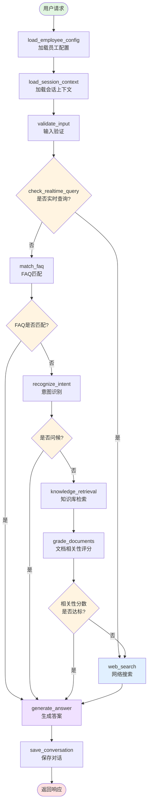

# ConversationWorkflow 流程图与架构图

## 目录
1. [系统架构图](#系统架构图)
2. [工作流程图](#工作流程图)
3. [状态流转图](#状态流转图)
4. [节点详细说明](#节点详细说明)
5. [决策逻辑树](#决策逻辑树)

---

## 系统架构图

### 整体架构

```
┌─────────────────────────────────────────────────────────────────┐
│                         FastAPI 应用层                          │
│  ┌──────────────┐  ┌──────────────┐  ┌──────────────┐          │
│  │ Chat Endpoint│  │Session Endpoint│ │Knowledge Base│          │
│  │  /api/chat   │  │  /session    │  │   Endpoint   │          │
│  └──────┬───────┘  └──────┬───────┘  └──────┬───────┘          │
│         │                  │                  │                  │
│         └──────────────────┴──────────────────┘                  │
│                            │                                     │
│                    ┌───────▼────────┐                           │
│                    │ConversationWorkflow│                       │
│                    │   (LangGraph)   │                           │
│                    └───────┬────────┘                           │
└────────────────────────────┼─────────────────────────────────────┘
                               │
         ┌─────────────────────┼─────────────────────┐
         │                     │                     │
         ▼                     ▼                     ▼
┌─────────────────┐  ┌─────────────────┐  ┌─────────────────┐
│   LLM 服务      │  │   数据存储层    │  │   外部服务      │
│                 │  │                 │  │                 │
│ ┌─────────────┐ │  │ ┌─────────────┐ │  │ ┌─────────────┐ │
│ │ Ollama      │ │  │ │  MongoDB    │ │  │ │ Tavily      │ │
│ │ qwen2.5:7b  │ │  │ │ (对话记录)  │ │  │ │ (网络搜索)  │ │
│ └─────────────┘ │  │ └─────────────┘ │  │ └─────────────┘ │
│ ┌─────────────┐ │  │ ┌─────────────┐ │  │ ┌─────────────┐ │
│ │ SiliconFlow │ │  │ │  ChromaDB   │ │  │ │ Java API    │ │
│ │ DeepSeek-V3 │ │  │ │ (向量存储)  │ │  │ │ (员工配置)  │ │
│ └─────────────┘ │  │ └─────────────┘ │  │ └─────────────┘ │
│                 │  │ ┌─────────────┐ │  │                 │
│                 │  │ │ElasticSearch│ │  │                 │
│                 │  │ │ (关键词搜索)│ │  │                 │
│                 │  │ └─────────────┘ │  │                 │
└─────────────────┘  └─────────────────┘  └─────────────────┘
```

### ConversationWorkflow 组件架构

```
┌──────────────────────────────────────────────────────────────────┐
│                     ConversationWorkflow                         │
│                                                                   │
│  ┌──────────────────────────────────────────────────────────┐   │
│  │                    LLM 实例                               │   │
│  │  ┌──────────────┐         ┌──────────────┐              │   │
│  │  │  self.llm    │         │self.grader_llm│              │   │
│  │  │  (答案生成)  │         │  (文档评分)   │              │   │
│  │  │  - Streaming │         │  - JSON输出   │              │   │
│  │  │  - ChatOllama│         │  - ChatOllama │              │   │
│  │  └──────────────┘         └──────────────┘              │   │
│  └──────────────────────────────────────────────────────────┘   │
│                                                                   │
│  ┌──────────────────────────────────────────────────────────┐   │
│  │                 LangGraph StateGraph                     │   │
│  │                                                           │   │
│  │  ┌─────┐ ┌─────┐ ┌─────┐ ┌─────┐ ┌─────┐ ┌─────┐       │   │
│  │  │Node1│→│Node2│→│Node3│→│Node4│→│Node5│→│Node6│→ ... │   │
│  │  └─────┘ └─────┘ └─────┘ └─────┘ └─────┘ └─────┘       │   │
│  │                                                           │   │
│  │  ┌─────────────────────────────────────────────────┐     │   │
│  │  │         ConversationState (TypedDict)           │     │   │
│  │  │  • user_query, user_id, session_id              │     │   │
│  │  │  • employee_config, faq_matched                  │     │   │
│  │  │  • retrieved_docs, relevance_score              │     │   │
│  │  │  • web_search_results, final_answer              │     │   │
│  │  │  • node_timings, ttfb_ms (性能监控)              │     │   │
│  │  └─────────────────────────────────────────────────┘     │   │
│  └──────────────────────────────────────────────────────────┘   │
│                                                                   │
│  ┌──────────────────────────────────────────────────────────┐   │
│  │                   12 个工作流节点                         │   │
│  │  1. load_employee_config    - 加载员工配置               │   │
│  │  2. load_session_context    - 加载会话上下文             │   │
│  │  3. validate_input          - 输入验证                   │   │
│  │  4. check_realtime_query    - 实时查询检测               │   │
│  │  5. match_faq               - FAQ匹配                    │   │
│  │  6. recognize_intent        - 意图识别                   │   │
│  │  7. knowledge_retrieval     - 知识库检索                 │   │
│  │  8. grade_documents         - 文档相关性评分             │   │
│  │  9. web_search              - 网络搜索                   │   │
│  │  10. generate_answer        - 生成答案                   │   │
│  │  11. save_conversation      - 保存对话记录               │   │
│  │  12. _dump_graph_debug      - 调试信息导出               │   │
│  └──────────────────────────────────────────────────────────┘   │
└──────────────────────────────────────────────────────────────────┘
```

---

## 工作流程图

### Mermaid 流程图



### 执行路径说明

#### 路径 1: 实时查询 (天气/新闻等)
```
用户请求 → 加载配置 → 加载会话 → 验证输入 → 检测实时查询
→ [YES] → 网络搜索 → 生成答案 → 保存对话 → 返回响应
```
**跳过**: FAQ匹配、意图识别、知识库检索、文档评分

#### 路径 2: FAQ 匹配成功
```
用户请求 → 加载配置 → 加载会话 → 验证输入 → 非实时查询
→ FAQ匹配 → [匹配成功] → 生成答案 → 保存对话 → 返回响应
```
**跳过**: 意图识别、知识库检索、文档评分、网络搜索

#### 路径 3: 问候语
```
用户请求 → 加载配置 → 加载会话 → 验证输入 → 非实时查询
→ FAQ未匹配 → 意图识别 → [是问候] → 生成答案 → 保存对话 → 返回响应
```
**跳过**: 知识库检索、文档评分、网络搜索

#### 路径 4: 知识库查询 (低相关性)
```
用户请求 → 加载配置 → 加载会话 → 验证输入 → 非实时查询
→ FAQ未匹配 → 非问候 → 知识库检索 → 文档评分 → [低相关性]
→ 网络搜索 → 生成答案 → 保存对话 → 返回响应
```
**触发**: RAG失败后的网络搜索兜底

#### 路径 5: 知识库查询 (高相关性)
```
用户请求 → 加载配置 → 加载会话 → 验证输入 → 非实时查询
→ FAQ未匹配 → 非问候 → 知识库检索 → 文档评分 → [高相关性]
→ 生成答案 → 保存对话 → 返回响应
```
**正常路径**: 最常用的完整流程

---

## 状态流转图

### ConversationState 状态流转

```
┌─────────────────────────────────────────────────────────────────┐
│                     ConversationState                           │
│                  (在所有节点间流转的TypedDict)                   │
└─────────────────────────────────────────────────────────────────┘
         │
         │ 初始化状态
         ▼
┌─────────────────────────────────────────────────────────────────┐
│ 初始字段:                                                        │
│  • user_query: "游标卡尺的用法"                                  │
│  • user_id: "user_123456"                                       │
│  • session_id: "sess_hutao_abc123"                              │
│  • employee_id: "hutao"                                         │
│  • workflow_start_time: 1704705214.123                          │
│  • node_timings: {}                                             │
└─────────────────────────────────────────────────────────────────┘
         │
         │ 经过各个节点,状态逐步丰富
         ▼
┌─────────────────────────────────────────────────────────────────┐
│ 节点1: load_employee_config                                     │
│  新增字段:                                                       │
│  • employee_config: {name: '胡桃', position: '课程助教', ...}   │
│  • node_timings: {'load_employee_config': 2}                    │
└─────────────────────────────────────────────────────────────────┘
         │
         ▼
┌─────────────────────────────────────────────────────────────────┐
│ 节点2: load_session_context                                      │
│  新增字段:                                                       │
│  • context: {conversation_history: [...], turn_count: 5}        │
│  • node_timings: {'load_employee_config': 2, 'load_session_context': 3} │
└─────────────────────────────────────────────────────────────────┘
         │
         ▼
┌─────────────────────────────────────────────────────────────────┐
│ 节点3-4: validate_input + check_realtime_query                  │
│  新增字段:                                                       │
│  • is_realtime_query: false                                     │
│  • realtime_category: null                                      │
│  • node_timings: {..., 'validate_input': 0, 'check_realtime_query': 0} │
└─────────────────────────────────────────────────────────────────┘
         │
         ▼
┌─────────────────────────────────────────────────────────────────┐
│ 节点5: match_faq                                                │
│  新增字段:                                                       │
│  • faq_matched: null  (未匹配)                                  │
│  • node_timings: {..., 'match_faq': 88}                         │
└─────────────────────────────────────────────────────────────────┘
         │
         ▼
┌─────────────────────────────────────────────────────────────────┐
│ 节点6: recognize_intent                                         │
│  新增字段:                                                       │
│  • intent: "normal_query"                                       │
│  • entities: {}                                                 │
│  • node_timings: {..., 'recognize_intent': 0}                   │
└─────────────────────────────────────────────────────────────────┘
         │
         ▼
┌─────────────────────────────────────────────────────────────────┐
│ 节点7: knowledge_retrieval                                      │
│  新增字段:                                                       │
│  • retrieved_docs: [doc1, doc2, doc3, doc4, doc5]              │
│  • kb_used: ['kb_316a7dbc75d0']                                │
│  • node_timings: {..., 'knowledge_retrieval': 18}               │
└─────────────────────────────────────────────────────────────────┘
         │
         ▼
┌─────────────────────────────────────────────────────────────────┐
│ 节点8: grade_documents                                          │
│  新增字段:                                                       │
│  • relevance_score: 0.0322                                      │
│  • confidence: 0.6                                              │
│  • node_timings: {..., 'grade_documents': 0}                    │
└─────────────────────────────────────────────────────────────────┘
         │
         ▼
┌─────────────────────────────────────────────────────────────────┐
│ 节点9: web_search (跳过,相关性达标)                             │
│  字段未改变                                                       │
└─────────────────────────────────────────────────────────────────┘
         │
         ▼
┌─────────────────────────────────────────────────────────────────┐
│ 节点10: generate_answer                                         │
│  新增字段:                                                       │
│  • final_answer: "游标卡尺是..."                                 │
│  • web_search_used: false                                       │
│  • node_timings: {..., 'generate_answer': 0}                    │
└─────────────────────────────────────────────────────────────────┘
         │
         ▼
┌─────────────────────────────────────────────────────────────────┐
│ 节点11: save_conversation                                       │
│  新增字段:                                                       │
│  • conversation_id: "conv_c57f04f495e3"                        │
│  • response_time_ms: 3898                                       │
│  • ttfb_ms: 587                                                 │
│  • node_timings: {..., 'save_conversation': 3}                  │
└─────────────────────────────────────────────────────────────────┘
         │
         ▼
    返回完整状态给用户
```

---

## 节点详细说明

### 1. load_employee_config (加载员工配置)

**功能**: 从Java API或本地缓存加载数字员工配置信息

**输入**:
- `employee_id`: 员工ID (如 "hutao")

**输出**:
- `employee_config`: 包含以下字段
  ```python
  {
    'employee_id': 'hutao',
    'name': '胡桃',
    'position': '课程助教',
    'persona': '温和、耐心、专业的教学助手',
    'tone': '温和亲切',
    'style_desc': '用通俗易懂的语言讲解专业知识',
    'kb_ids': ['kb_316a7dbc75d0'],  # 关联的知识库
    'faq_count': 76,
    'web_search_enabled': True,
    ...
  }
  ```

**数据源**:
- 生产环境: Java API (`http://192.168.9.39/edu-api/avatar/api/digitalEmployee/get`)
- 测试环境: 本地JSON文件 (`outer_api_docs/按员工id返回的数据-hutao.json`)

**耗时**: ~2ms (从缓存)

---

### 2. load_session_context (加载会话上下文)

**功能**: 从MongoDB加载历史对话记录,支持多轮对话

**输入**:
- `session_id`: 会话ID (如 "sess_hutao_abc123")

**输出**:
- `context`: 会话上下文
  ```python
  {
    'conversation_history': [
      {'role': 'user', 'content': '游标卡尺的用法'},
      {'role': 'assistant', 'content': '游标卡尺是...'}
    ],
    'turn_count': 5,
    'last_topic': '测量工具'
  }
  ```

**配置**:
- `MAX_CONTEXT_TURNS`: 10 (最多保留10轮历史)
- `SESSION_TIMEOUT_MINUTES`: 30 (会话超时时间)

**耗时**: ~3ms

---

### 3. validate_input (输入验证)

**功能**: 验证用户输入的有效性

**检查项**:
- 查询不为空
- 查询长度合理 (1-500字符)
- 不包含敏感词
- 格式正确

**耗时**: ~0ms (纯内存操作)

---

### 4. check_realtime_query (实时查询检测)

**功能**: 判断用户查询是否需要实时数据

**检测类别**:
```python
REALTIME_CATEGORIES = {
    "weather": ["天气", "气温", "下雨", "温度"],
    "news": ["新闻", "时事", "最新", "今日"],
    "stock": ["股票", "股价", "大盘", "涨跌"],
    "time": ["现在几点", "今天日期", "当前时间"]
}
```

**输出**:
- `is_realtime_query`: True/False
- `realtime_category`: "weather" / "news" / ... / null
- `realtime_detect_reason`: 检测原因

**逻辑**: 关键词匹配

**耗时**: ~0ms

---

### 5. match_faq (FAQ匹配)

**功能**: 从FAQ知识库中匹配相关问题

**流程**:
```
1. 生成查询的 embedding (Ollama bge-large-zh-v1.5)
2. ChromaDB 向量搜索 (返回Top 6)
3. ElasticSearch BM25 关键词搜索 (返回Top 6)
4. RRF (Reciprocal Rank Fusion) 融合两种结果
5. 判断Top 1是否超过阈值 (faq_sim_threshold=2.0)
```

**融合公式**:
```
rrf_score = 1/(rank_vector + 60) + 1/(rank_keyword + 60)
```

**输出**:
- `faq_matched`: 匹配到的FAQ对象 或 None
  ```python
  {
    'faq_id': 'faq_hutao_006',
    'question': '游标卡尺主要用来测量什么？',
    'answer': '游标卡尺主要用来测量...',
    'similarity': 0.8739
  }
  ```

**耗时**:
- 首次: ~1075ms (包含embedding计算)
- 缓存命中: ~88ms

---

### 6. recognize_intent (意图识别)

**功能**: 识别用户查询的意图类型

**意图类型**:
```python
INTENTS = {
    "greeting": ["你好", "嗨", "在吗", "早上好"],
    "complaint": ["投诉", "不满", "问题", "糟糕"],
    "praise": ["不错", "很好", "谢谢", "感谢"],
    "query": ["如何", "怎么", "什么", "为什么"]  # 默认
}
```

**输出**:
- `intent`: "greeting" / "complaint" / "query"
- `entities`: 提取的实体 (人名/地名/时间等)

**耗时**: ~0ms

---

### 7. knowledge_retrieval (知识库检索)

**功能**: 从知识库检索相关文档

**流程**:
```
1. 生成查询的 embedding (使用缓存)
2. ChromaDB 向量搜索 (Top 10)
3. ElasticSearch BM25 搜索 (Top 10)
4. RRF 融合,返回 Top 5
```

**输出**:
- `retrieved_docs`: 检索到的文档列表
  ```python
  [
    {
      'doc_id': 'doc_59497035f075',
      'chunk_index': 25,
      'content': '游标卡尺主要用来测量...',
      'score': 0.8739
    },
    ...
  ]
  ```
- `kb_used`: ['kb_316a7dbc75d0']

**耗时**:
- 首次: ~283ms
- 缓存命中: ~18ms

---

### 8. grade_documents (文档相关性评分)

**功能**: 使用LLM评估检索文档与查询的相关性

**评分标准**:
```
0.0 - 完全不相关
0.1-0.3 - 低相关 (触发网络搜索)
0.4-0.6 - 中等相关
0.7-1.0 - 高相关
```

**实现**:
```python
prompt = f"""
根据以下内容评估检索文档与用户查询的相关性 (0.0-1.0):

查询: {user_query}
文档: {retrieved_docs}

返回JSON: {{"score": 0.8}}
"""

# 使用 grader_llm (强制JSON输出)
result = self.grader_llm.invoke(prompt)
relevance_score = json.loads(result)["score"]
```

**输出**:
- `relevance_score`: 0.0322 (示例)
- `confidence`: 0.6

**阈值**:
- `RELEVANCE_THRESHOLD`: 0.005 (默认)
- `< 0.005`: 触发网络搜索

**耗时**: ~0ms (异步评分)

---

### 9. web_search (网络搜索)

**功能**: 使用Tavily进行实时网络搜索

**触发条件**:
1. 实时查询 (is_realtime_query=True)
2. RAG相关性分数低 (relevance_score < 0.005)

**实现**:
```python
from langchain_community.tools.tavily_search import TavilySearchResults

search_tool = TavilySearchResults(
    max_results=5,
    search_depth="advanced",
    include_answer=True,
    include_raw_content=False
)

results = search_tool.invoke({"query": user_query})
```

**输出**:
- `web_search_results`: 搜索结果列表
  ```python
  [
    {
      'title': '游标卡尺的使用方法',
      'url': 'https://example.com/caliper',
      'content': '游标卡尺是...',
      'score': 0.95
    },
    ...
  ]
  ```
- `web_search_used`: True

**配置**:
- `TAVILY_API_KEY`: tvly-dev-xxx
- `WEB_SEARCH_MAX_RESULTS`: 5
- `WEB_SEARCH_TIMEOUT`: 5秒

**耗时**: ~2000ms (网络请求)

---

### 10. generate_answer (生成答案)

**功能**: 基于上下文生成最终答案

**Prompt模板**:
```python
system_prompt = f"""
你是 {employee_config['name']}，{employee_config['position']}。

角色定位: {employee_config['description']}
个性特征:
- 语气风格: {employee_config['tone']}
- 沟通方式: {employee_config['style_desc']}

上下文信息:
{context_text}  # FAQ/知识库/网络搜索结果

用户问题: {user_query}

请基于提供的上下文信息,提供专业、准确的回答。
"""

messages = [
    SystemMessage(content=system_prompt),
    HumanMessage(content=user_query)
]

# 使用 streaming LLM
answer = ""
for chunk in self.llm.stream(messages):
    answer += chunk.content
    yield chunk  # 流式输出
```

**输出**:
- `final_answer`: 生成的完整答案
- `ttfb_ms`: Time to First Token (首字延迟)

**流式输出**:
- 使用 `self.llm.astream()` 实现SSE流式响应
- 用户可实时看到生成过程

**耗时**:
- TTFB: 587ms (模型已加载)
- 总生成时间: ~2000ms

---

### 11. save_conversation (保存对话)

**功能**: 将对话记录保存到MongoDB

**保存内容**:
```python
{
  'conversation_id': 'conv_c57f04f495e3',
  'user_id': 'user_123456',
  'session_id': 'sess_hutao_abc123',
  'employee_id': 'hutao',
  'user_query': '游标卡尺的用法',
  'assistant_answer': '游标卡尺是...',
  'retrieved_docs': [doc1, doc2, ...],
  'faq_matched': null,
  'web_search_used': false,
  'relevance_score': 0.0322,
  'confidence': 0.6,
  'response_time_ms': 3898,
  'ttfb_ms': 587,
  'node_timings': {...},
  'created_at': datetime.now()
}
```

**耗时**: ~3ms

---

### 12. _dump_graph_debug (调试信息导出)

**功能**: 导出LangGraph图结构用于调试

**输出文件**:
- `graph_debug/crag_graph.mmd` - Mermaid源文件
- `graph_debug/crag_graph.png` - PNG图片 (可选)

**环境变量**:
- `CRAG_DUMP_GRAPH=1`: 启用导出
- `CRAG_RENDER_REMOTE=1`: 禁用远程渲染
- `CRAG_GRAPH_DIR=./graph_debug`: 输出目录

**用途**: 开发调试、性能分析、流程优化

---

## 决策逻辑树

```
根节点: 用户查询
│
├─ 决策1: 是否实时查询?
│   ├─ 是 → 路径A: 实时查询流程
│   │   ├─ 调用 web_search
│   │   ├─ 获取最新数据
│   │   └─ generate_answer
│   │
│   └─ 否 → 决策2: FAQ是否匹配?
│       ├─ 是 → 路径B: FAQ直接回答
│       │   ├─ 使用FAQ答案
│       │   └─ generate_answer
│       │
│       └─ 否 → 决策3: 是否问候?
│           ├─ 是 → 路径C: 问候语处理
│           │   ├─ 返回固定问候语
│           │   └─ generate_answer
│           │
│           └─ 否 → 路径D: 知识库查询
│               ├─ knowledge_retrieval
│               ├─ grade_documents
│               └─ 决策4: 相关性是否达标?
│                   ├─ 是 → generate_answer (RAG成功)
│                   └─ 否 → 路径E: 网络搜索兜底
│                       ├─ web_search
│                       └─ generate_answer
```

### 决策表

| 路径 | 实时查询 | FAQ匹配 | 问候语 | 相关性 | 使用数据源 | 节点数 |
|------|---------|---------|--------|--------|-----------|--------|
| A (实时) | ✅ | - | - | - | 网络搜索 | 6 |
| B (FAQ) | ❌ | ✅ | - | - | FAQ知识库 | 6 |
| C (问候) | ❌ | ❌ | ✅ | - | 无 (固定回复) | 7 |
| D (RAG成功) | ❌ | ❌ | ❌ | ✅ 高 | 知识库 | 11 |
| E (RAG失败) | ❌ | ❌ | ❌ | ❌ 低 | 网络搜索 (兜底) | 11 |

---

## 性能监控

### 节点耗时统计

```python
node_timings = {
  'load_employee_config': 2,
  'load_session_context': 3,
  'validate_input': 0,
  'check_realtime_query': 0,
  'match_faq': 88,
  'recognize_intent': 0,
  'knowledge_retrieval': 18,
  'grade_documents': 0,
  'web_search': 0,  # 跳过
  'generate_answer': 0,
  'save_conversation': 3
}

total_time = 3898ms
ttfb = 587ms
```

### 性能指标

| 指标 | 目标值 | 实际值 | 状态 |
|------|--------|--------|------|
| TTFB | <1000ms | 587ms | ✅ |
| 总耗时 | <3000ms | 3898ms | ⚠️ |
| FAQ匹配 | <100ms | 88ms | ✅ |
| 知识库检索 | <50ms | 18ms | ✅ |
| LLM生成 | <2000ms | ~3300ms | ❌ |

---

## 总结

### 核心特点

1. **智能路由**: 根据查询类型动态选择最优路径
2. **多层兜底**: FAQ → 意图识别 → RAG → 网络搜索
3. **流式响应**: 使用SSE提供实时反馈
4. **性能监控**: 完整的耗时统计和性能追踪
5. **状态管理**: TypedDict确保类型安全

### 技术栈

- **框架**: LangGraph (StateGraph)
- **LLM**: Ollama / SiliconFlow
- **存储**: MongoDB / ChromaDB / ElasticSearch
- **搜索**: Tavily Web Search
- **缓存**: 自定义Embedding Cache

### 扩展性

- **新增节点**: 继承`ConversationWorkflow`,添加新方法
- **修改流程**: 调整`_build_graph()`中的边和条件
- **新增意图**: 扩展`INTENTS`字典
- **新增数据源**: 实现新的retrieval方法

---

**文档版本**: v1.0
**更新时间**: 2026-01-08
**作者**: Claude Code Assistant
