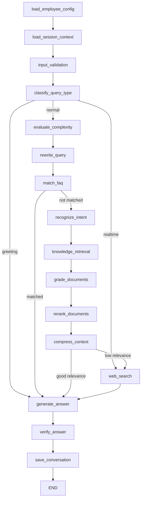

# Conversation Workflow 详解

## 概述

本项目基于 **LangGraph** 构建了一个状态驱动的对话工作流系统，支持多源知识检索（RAG + FAQ + Web Search）、查询优化、双 LLM 架构以及流式响应。

```
┌─────────────────────────────────────────────────────────────────────────────┐
│                         Conversation Workflow                               │
│                        17 Nodes + Conditional Routing                       │
└─────────────────────────────────────────────────────────────────────────────┘
```

---

## 核心架构

### 1. 状态定义 (ConversationState)

状态对象在工作流节点间流转，包含所有对话处理所需信息：

| 字段类别 | 字段名 | 类型 | 说明 |
|---------|--------|------|------|
| **用户输入** | `user_query` | str | 用户原始查询 |
| | `user_id` | str | 用户ID |
| | `session_id` | str | 会话ID |
| | `employee_id` | str | 数字员工ID |
| **配置** | `employee_config` | dict | 员工配置（角色、性格、能力等） |
| **检测** | `is_realtime_query` | bool | 是否为实时查询 |
| | `realtime_category` | str | 实时查询分类（time/weather/news/market） |
| | `intent` | str | 意图（greeting/general_query/faq_match） |
| | `entities` | dict | 提取的实体信息 |
| **RAG** | `retrieved_docs` | list | 检索到的文档 |
| | `relevance_score` | float | 文档相关性分数 |
| | `kb_used` | list | 使用的知识库ID列表 |
| **Web搜索** | `web_search_results` | list | 网络搜索结果 |
| | `web_search_used` | bool | 是否使用了网络搜索 |
| **输出** | `final_answer` | str | 最终回答 |
| | `confidence` | float | 置信度 |
| | `conversation_id` | str | 对话记录ID |
| **性能** | `response_time_ms` | int | 总响应时间（毫秒） |
| | `node_timings` | dict | 各节点执行时间 |
| | `ttfb_ms` | int | 首字节时间 |
| **优化** | `rewritten_query` | str | 重写后的查询 |
| | `query_rewritten` | bool | 查询是否被重写 |
| | `compressed_context` | str | 压缩后的上下文 |
| | `answer_verified` | bool | 答案是否已验证 |
| **复杂度** | `complexity_score` | float | 问题复杂度 (0-10) |
| | `complexity_reason` | str | 复杂度评分原因 |

---

## 工作流图

### 完整流程图



### 快速路径（Fast Path）

系统设计了多个快速路径以提升响应速度：

```
┌─────────────────────────────────────────────────────────────┐
│                        Fast Paths                            │
├─────────────────────────────────────────────────────────────┤
│  1. 问候语检测 → 直接生成回答（跳过RAG、FAQ）                 │
│  2. 实时查询 → Web搜索 → 生成回答                             │
│  3. FAQ命中 → 直接返回答案（跳过RAG）                         │
└─────────────────────────────────────────────────────────────┘
```

---

## 节点详解

### 阶段一：初始化 (3个节点)

#### 1. load_employee_config
加载数字员工配置，包含：
- 基本信息：name, role, description
- 性格配置：tone, style, formality
- 能力配置：web_search_enabled, kb_ids
- FAQ配置：faq_sim_threshold, faq_top_k

#### 2. load_session_context
加载或创建会话上下文：
- 已有会话：加载最近10条消息历史
- 新会话：创建新的 session 记录
- 更新 last_activity 时间戳

#### 3. input_validation
输入验证与清理：
- 基础格式验证
- 敏感内容检测（预留接口）

---

### 阶段二：查询分类 (1个节点 + 路由)

#### 4. classify_query_type
快速识别查询类型并路由，**检测顺序从快到慢**：

| 检测类型 | 方法 | 触发关键词示例 | 路由目标 |
|---------|------|---------------|---------|
| **问候语** | 关键词匹配 | 你好、嗨、哈喽、早上好 | generate_answer |
| **实时查询** | 关键词匹配 | 天气、新闻、股价 | web_search |
| **普通查询** | 默认 | - | evaluate_complexity |

**问候语关键词库**：
```python
GREETING_KEYWORDS = {
    "basic": ["你好", "您好", "hi", "hello", "嗨"],
    "time": ["早上好", "早", "晚上好", "晚安"],
    "casual": ["哈喽", "在吗", "在不在"],
    "polite": ["打扰一下", "请问", "不好意思"]
}
```

**实时查询关键词库**：
```python
realtime_keywords = {
    "time": ["今天", "明天", "最近", "当前"],
    "weather": ["天气", "气温", "降雨"],
    "news": ["新闻", "热点", "最新", "资讯"],
    "market": ["股价", "汇率", "价格"]
}
```

---

### 阶段三：复杂度评估 (2个节点)

#### 5. evaluate_complexity
评估问题复杂度（0-10分），用于 LLM 路由决策：

| 分数范围 | 复杂度 | LLM选择 |
|---------|--------|---------|
| 0-6 | 简单到中等 | 本地 Ollama |
| 7-10 | 复杂 | 外部 API |

评估维度：
1. 问题长度
2. 问题类型（简单问答 vs 复杂推理）
3. 是否需要多步推理
4. 是否需要综合多个信息源

#### 6. rewrite_query
查询重写（可选，默认关闭）：
- **触发条件**：查询 < 20 字符
- **目的**：扩展简短查询，添加相关关键词
- **跳过场景**：问候语、FAQ就绪查询

---

### 阶段四：FAQ快速匹配 (1个节点)

#### 7. match_faq
FAQ快速路径，**命中则跳过RAG**：

```python
# 流程
1. 混合检索（向量 + BM25）+ RRF融合
2. 过滤：faq_sim_threshold
3. 质量检查：RRF score >= 0.02（避免误匹配）
4. 随机选择：从 answers 数组中随机选一个
5. 跳过RAG：直接使用FAQ答案
```

**配置参数**：
- `faq_sim_threshold`: FAQ相似度阈值
- `faq_top_k`: FAQ检索Top-K数量

---

### 阶段五：RAG检索管道 (4个节点)

#### 8. recognize_intent
意图识别（当前主要用于问候语确认）：
- greeting: 问候语（已在classify_query_type处理）
- general_query: 默认，需要知识检索

#### 9. knowledge_retrieval
混合知识检索：

```python
# 混合检索策略
1. 向量搜索 (ChromaDB): top_k=5
2. 关键词搜索 (ElasticSearch): top_k=5
3. RRF融合: score = 1/(rank + k), k=60
4. 返回融合排序后的结果
```

#### 10. grade_documents
文档评分：
- 使用最佳文档的 RRF 分数作为整体相关性分数
- 用于决定是否触发 Web Search 回退

#### 11. rerank_documents
文档重排序（可选，默认关闭）：
- **触发条件**：3-10 个文档
- 使用 Grader LLM 对文档相关性重新评分
- 按新分数排序，优化上下文顺序

---

### 阶段六：上下文优化 (1个节点)

#### 12. compress_context
上下文压缩（可选，默认关闭）：
- **触发条件**：总上下文 > 1500 字符
- 保留与用户问题相关的信息
- 去除重复和冗余内容
- 控制压缩后不超过 500 字

---

### 阶段七：Web搜索回退 (1个节点)

#### 13. web_search
网络搜索，**两个触发场景**：

1. **实时查询**：直接触发（天气、新闻、股价等）
2. **低相关性回退**：relevance_score < relevance_threshold (默认0.6)

使用 Tavily Search API：
- 默认返回 top 3 结果
- 包含 title, url, content, score

**检查项**：
- settings.web_search_enabled
- tavily_api_key 已配置
- employee capabilities.web_search_enabled

---

### 阶段八：答案生成与验证 (3个节点)

#### 14. generate_answer
答案生成准备：
- 计算置信度
- 准备元数据
- **实际LLM流式生成在 API 端点执行**

置信度计算策略：
```python
if FAQ命中:     confidence = 0.95
elif Web搜索:   confidence = max(0.75, avg_web_score)
elif RAG文档:   confidence = max(0.6, relevance_score)
else:           confidence = 0.5
```

#### 15. verify_answer
答案验证（可选，默认关闭）：
- 检查关键信息是否在源文档中
- 检测幻觉或编造内容
- 检测与源文档矛盾的陈述
- **跳过场景**：FAQ、问候语

#### 16. save_conversation
保存对话记录到 MongoDB：
- conversations 集合：保存完整对话
- sessions 集合：更新消息历史（保留最近20条）

---

## LLM 路由策略

### 双 LLM 架构

```python
# 本地 LLM (Ollama)
local_llm = ChatOllama(
    base_url=settings.ollama_base_url,
    model=settings.ollama_model,  # qwen2.5:7b
    temperature=0
)

# 远程 LLM (OpenAI-style API)
remote_llm = ChatOpenAI(
    base_url=settings.openai_api_base,
    model=settings.openai_model,  # deepseek-ai/DeepSeek-V3
    temperature=0.7
)
```

### 路由模式

| 模式 | 配置值 | 行为 |
|-----|--------|------|
| **仅本地** | `local_only` | 始终使用 Ollama |
| **仅远程** | `remote_only` | 始终使用外部API |
| **混合** | `hybrid` | 动态选择 |

### 混合模式决策逻辑

```
┌─────────────────────────────────────────────────────────────┐
│                    混合模式 LLM 选择                          │
├─────────────────────────────────────────────────────────────┤
│  IF intent == "greeting" OR faq_matched:                    │
│      → 使用本地 Ollama（快速响应）                            │
│  ELSE IF complexity_score >= 7.0:                           │
│      → 使用外部 API（高质量推理）                             │
│  ELSE:                                                       │
│      → 使用本地 Ollama（简单查询）                            │
└─────────────────────────────────────────────────────────────┘
```

**复杂度阈值**：`COMPLEXITY_THRESHOLD` (默认 7.0)

---

## 消息构建策略

### 问候语消息

```python
system_prompt = f"""你是 {name}，{role}。

角色定位：{description}
个性特征：- 语气风格：{tone_desc}
- 正式程度：{formality_desc}

开场白：{greeting}

**当前场景**：用户向你发起问候（"{matched_keyword}"）。

回答要求：
1. {style_hint}  # 根据问候类型定制的回复提示
2. 回复要简洁（不超过 50 字）
3. 保持 {tone_desc} 的语气风格
4. 不要提及"我是AI"或"我是机器人"
5. 不要提供任何具体信息（除非用户主动询问）"""
```

### 常规查询消息

```python
# 基础提示词
base_prompt = f"""你是 {name}，{role}。

角色定位：{description}
个性特征：
- 语气风格：{tone_desc}
- 沟通方式：{style_desc}
- 正式程度：{formality_desc}

开场白：{greeting}"""

# 场景特定要求
IF 实时查询 + Web搜索:
    requirements = """1. **必须基于网络资料回答**
    2. 直接提取关键信息
    3. **不要说"无法提供实时数据"**"""
ELSE:
    requirements = """1. 严格基于上下文回答，不编造内容
    2. 如果上下文不足，诚实告知"""
```

---

## 性能监控

### 节点计时

每个节点执行时间都会被记录：

```python
async with time_node("knowledge_retrieval", state):
    # 检索逻辑...

# state["node_timings"] = {
#     "load_employee_config": 5,
#     "knowledge_retrieval": 123,
#     "generate_answer": 456,
#     ...
# }
```

### TTFB (Time To First Byte)

流式响应的首字节时间，用于评估响应速度：

```python
state["ttfb_ms"] = 234  # 首token生成时间
```

### 总响应时间

```python
response_time_ms = int((time.time() - workflow_start_time) * 1000)
```

---

## 配置开关

| 配置项 | 默认值 | 说明 |
|-------|--------|------|
| `QUERY_REWRITE_ENABLED` | False | 查询重写开关 |
| `RERANK_ENABLED` | False | 文档重排序开关 |
| `CONTEXT_COMPRESSION_ENABLED` | False | 上下文压缩开关 |
| `ANSWER_VERIFICATION_ENABLED` | False | 答案验证开关 |
| `WEB_SEARCH_ENABLED` | True | Web搜索总开关 |
| `REALTIME_QUERY_ENABLED` | True | 实时查询检测开关 |
| `LLM_ROUTING_MODE` | local_only | LLM路由模式 |
| `COMPLEXITY_THRESHOLD` | 7.0 | 复杂度路由阈值 |
| `RELEVANCE_THRESHOLD` | 0.6 | 相关性回退阈值 |

---

## 流式响应

### SSE (Server-Sent Events)

```
事件类型流程：
user_query → role → token → token → ... → token → done
```

| 事件类型 | 说明 |
|---------|------|
| `user_query` | 回显原始查询 |
| `role` | 消息角色（assistant） |
| `token` | 单个LLM输出token |
| `done` | 流结束（包含timing和sources） |
| `error` | 错误信息 |

---

## 数据库交互

### MongoDB 集合

| 集合名 | 用途 |
|-------|------|
| `digital_employee_configs` | 员工配置 |
| `sessions` | 会话上下文 |
| `conversations` | 对话记录 |
| `faqs` | FAQ数据 |
| `documents` | 文档元数据 |

### ChromaDB 集合

| 集合名 | 用途 |
|-------|------|
| `doc` | 文档chunk向量 |
| `faq` | FAQ向量 |

### ElasticSearch 索引

| 索引名 | 用途 |
|-------|------|
| `digital_employee_*` | BM25关键词搜索 |

---

## 常见问题

### Q1: 如何调试工作流？

查看生成的流程图：
```bash
cat graph_debug/crag_graph.mmd
```

### Q2: 如何查看各节点耗时？

查看日志中的 `[TIMING]` 标记：
```
[INFO] [TIMING] knowledge_retrieval - 123ms
[INFO] [TIMING_SUMMARY] total: 567ms, ttfb: 234ms
```

### Q3: 如何启用高级功能？

修改 `.env` 或 `.env-local`：
```bash
QUERY_REWRITE_ENABLED=true
RERANK_ENABLED=true
CONTEXT_COMPRESSION_ENABLED=true
```

---

## 文件结构

```
app/services/conversation/
├── conversation_service.py      # 工作流主入口
├── conversation_nodes.py        # 17个节点实现
├── conversation_state.py        # 状态定义
└── conversation_helpers.py      # 辅助函数
```
