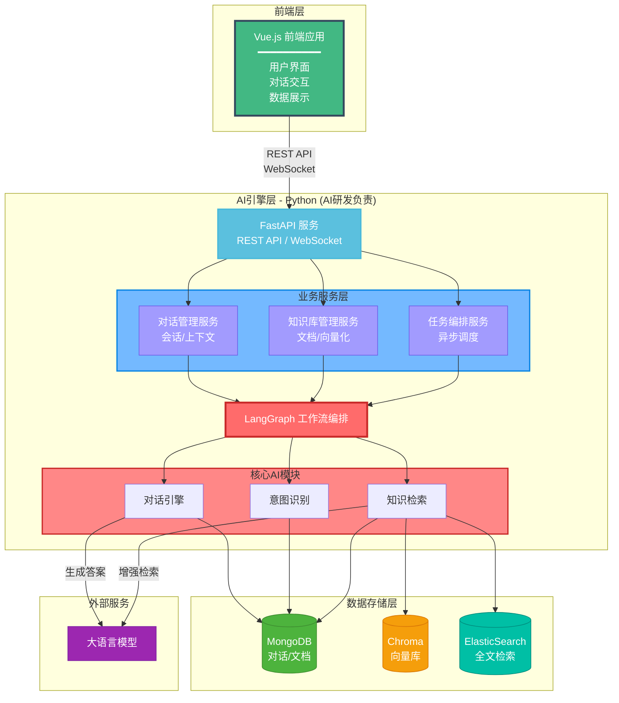
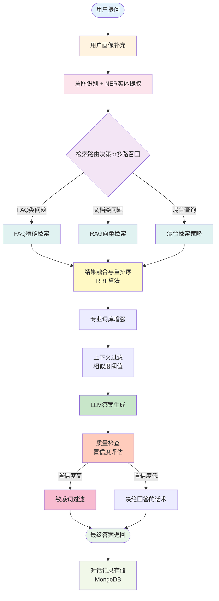
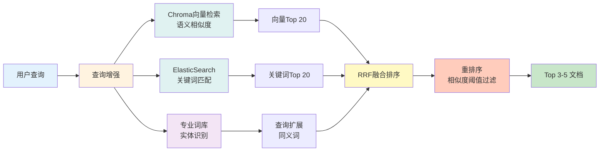
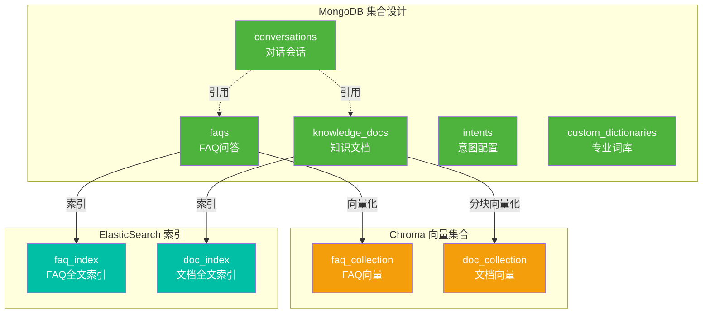
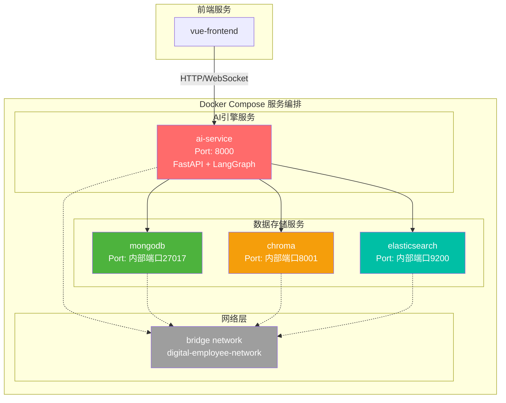

# 数字员工项目需求分析报告（架构图版）

## 🎯 项目定位
一个企业级AI对话助手平台，支持多知识库、意图识别、对话管理的智能客服/助手系统。

**团队组成**：4人小团队（1前端 + 1AI研发 + 2其他）  

**核心关注**：Agent回答的准确性（知识库召回、意图理解、答案生成质量）

---

## 系统架构设计

### 系统总览架构图

**架构说明：**
-  **Vue.js 前端**：用户交互界面，通过 REST API 和 WebSocket 与 AI 引擎通信
-  **Python AI 引擎**：AI研发核心工作区域，包含：
   - **FastAPI 服务**：提供 REST API 和 WebSocket 接口
   - **LangGraph 工作流编排**：核心对话流程控制
   - **对话管理服务**：会话管理、上下文维护、多轮对话
   - **知识库管理服务**：文档上传、向量化、检索管理
   - **任务编排服务**：异步任务调度、工作流执行
-  **数据存储层**：MongoDB（文档）、Chroma（向量）、ElasticSearch（检索）
-  **外部服务**：DeepSeek/Qwen 大语言模型 API

---

### 项目的流程

**工作流说明：**
1. **用户画像补充**：识别用户角色、历史上下文
2. **意图识别 + NER**：分类用户意图，提取关键实体
3. **检索路由决策**：根据意图选择 FAQ/RAG/混合检索
4. **结果融合与重排序**：使用 RRF 算法融合多路检索结果
5. **专业词库增强**：同义词扩展、实体识别
6. **LLM答案生成**：基于检索上下文生成答案
7. **质量检查**：置信度评估，低于阈值转人工
8. **敏感词过滤**：内容安全检查
9. **对话记录**：完整流程日志存储

---

### 混合检索策略架构

**检索策略说明：**
- **向量检索（Chroma）**：语义相似度匹配，召回相关文档
- **关键词检索（ElasticSearch）**：精确关键词匹配，提高准确性
- **专业词库**：实体识别、同义词扩展，增强查询能力
- **RRF 融合**：Reciprocal Rank Fusion 算法融合多路结果
- **重排序**：基于相似度阈值过滤，保证结果质量

---

### 数据库架构设计

**数据库设计说明：**
- **MongoDB**：存储对话记录、知识文档、FAQ、意图配置、词库
- **Chroma**：存储 FAQ 和文档的向量 embedding
- **ElasticSearch**：建立全文检索索引，支持关键词精确匹配
- **数据同步**：MongoDB 数据变更时，自动同步到 Chroma 和 ES（需要同步嘛）

---

### Docker Compose 容器化架构

**容器化说明：**
- **vue-frontend**：Vue.js 前端，Nginx 静态服务器
- **ai-service**：Python FastAPI + LangGraph AI 引擎（提供 REST API 和 WebSocket 接口）
- **mongodb**：文档数据库
- **chroma**：向量数据库
- **elasticsearch**：全文检索引擎
- **网络**：所有服务在同一 Docker 网络中通信

---

## 核心功能模块

### 1. 对话管理系统
- 知识库配置、开场白/热门问题设定、角色人设
- 对话规则、异常处理规则、安全规则
- 插件系统、专业词库集成、二元评价机制

### 2. 意图识别引擎
- 意图配置管理（意图名称、描述）
- 意图调优工具（辅助编写描述）
- 高级设置（直接配置提示词）

### 3. 知识库系统（双模式）
- **RAG文档库**：文档上传、知识片段管理、向量检索
- **FAQ问答库**：结构化问答对、语义检索、答案一致性保证
- 支持多知识库、专业词库增强检索准确性

### 4. 词库管理
- **专有名称词库**：行业术语、产品名称、实体词库
- **敏感词库**：内容安全过滤、合规性保障
- 版本管理、权限管理、导入导出

### 5. 对话记录分析
- 对话记录查看、搜索、筛选、导出
- 对话统计分析、用户行为洞察

---

## 技术栈总结

### 前端技术栈
- **框架**：Vue.js 3
- **UI组件库**：Element Plus
- **状态管理**：Pinia
- **HTTP客户端**：Axios
- **实时通信**：WebSocket

### AI引擎技术栈（Python）
- **Web框架**：FastAPI（REST API + WebSocket）
- **工作流编排**：LangGraph（状态机工作流）
- **业务服务**：
  - 对话管理服务（会话管理、上下文维护）
  - 知识库管理服务（文档处理、向量化管理）
  - 任务编排服务（异步任务、后台作业）
- **LLM集成**：OpenAI API / Claude API / DeepSeek / Qwen
- **向量数据库**：Chroma
- **全文检索**：ElasticSearch
- **文档数据库**：MongoDB
- **异步处理**：asyncio、Celery（可选）

### 容器化
- **容器运行时**：Docker
- **编排工具**：Docker Compose
- **生产环境**：Kubernetes（可选）

---

## 开发优先级

### Phase 1（2周）：基础服务搭建
- [ ] FastAPI 服务框架（REST API + WebSocket）
- [ ] 对话管理服务（会话创建、上下文存储）
- [ ] LangGraph 工作流搭建
- [ ] 意图识别模块（基于 LLM）
- [ ] 流式响应接口

### Phase 2（2周）：知识库管理
- [ ] 知识库管理服务（文档上传、管理接口）
- [ ] 文档处理管线（分块/向量化）
- [ ] FAQ 问答库实现
- [ ] 混合检索策略（Chroma + ES）
- [ ] 专业词库集成

### Phase 3（1周）：质量保障
- [ ] 敏感词过滤
- [ ] 答案质量评估
- [ ] 对话记录分析
- [ ] 二元评价反馈

### Phase 4（1周）：系统集成
- [ ] 任务编排服务（异步任务、后台作业）
- [ ] Docker 容器化
- [ ] FastAPI 接口优化（鉴权、限流、错误处理）
- [ ] 性能优化（缓存、批处理）
- [ ] 前后端联调（Vue ↔ FastAPI）

---

## 关键文件位置

- **需求文档**：`requirements.md`
- **原型截图**：`docs/prototype_screenshots/*.png`
- **技术规划**：`docs/数字员工项目-AI研发工作规划指南.md`
- **FAQ设计**：`docs/关于FAQ问答库.md`
- **对话风格**：`docs/关于Agent对话风格分类.md`
- **AI指南**：`.github/copilot-instructions.md`
