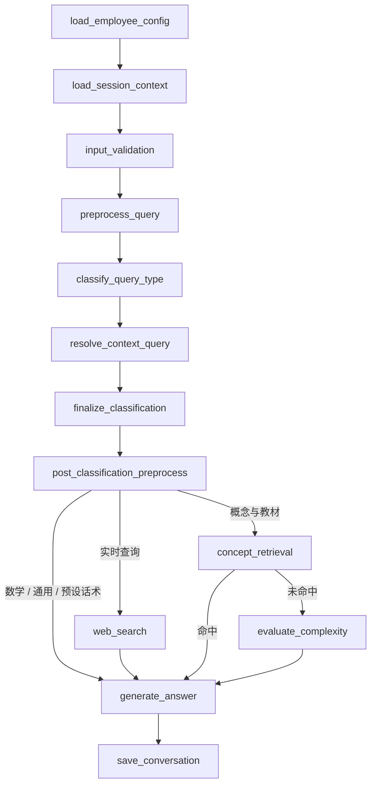

# ZengKingMorphe 项目结构梳理与优化路线图

> 更新日期：2026-09-19 · v3（代码核查版）
> 核查基线：本地 `math-before-industrial`，HEAD `26ad0dc`。
> 本次产出：结构分析与实施路线；未执行目录迁移、配置切换、分支清理或服务器部署。

## 1. 结论与边界

项目应围绕 **ai-service 应用、知识库工具、外部模型服务** 三个边界整理。近期收益最大的工作是建立接口回归基线、收敛配置读取方式、拆分会话与流式输出职责；模型部署目录外迁随后进行。

沿用 v2 的产品约束：数学产品和工业训练产品分别维护，共享前端，保留现有聊天 API。此约束是规划前提，不代表两个分支的接口行为已经自动一致。暂不合并产品分支，也不以任意“共享代码比例”作为合并门槛。

信息按以下口径区分：

- **已核实**：本地代码、脚本和 Git 分支快照可直接支持的事实。
- **规划约束**：沿用原文的产品边界、共享前端和模型服务外部化方向。
- **待核实**：线上部署主机、运行进程、实际模型版本、配置生效值和维护负责人。本次未连接服务器，不能用 Compose 内容代替线上事实。

数学链路重构与 `math_agent_service.py` 移除已纳入提交 `26ad0dc`。后续结构调整仍应与功能变更分开提交，保证每一步可独立回退。

## 2. 当前项目结构

### 2.1 仓库职责分布

```text
ZengKingMorphe-math/
├── ai-service/                         应用主体
│   ├── main.py                         FastAPI 生命周期和路由注册
│   ├── app/
│   │   ├── api/endpoints/              HTTP、SSE、WebSocket 适配
│   │   ├── api/middleware/             认证、限流、错误处理
│   │   ├── core/                       Settings、日志、数据库连接
│   │   ├── models/                     请求响应与数据模型
│   │   ├── services/
│   │   │   ├── conversation_service.py 工作流装配、模型创建
│   │   │   ├── conversation/           状态、路由、节点、辅助逻辑
│   │   │   └── ...                     分类、RAG、文档、词库等服务
│   │   └── utils/                      分句、公式、TTS、embedding 等
│   ├── prompts/                        提示词资源
│   ├── scripts/                        评测、迁移与维护脚本
│   ├── tests/                          单测、集成测试和手工运行脚本混合
│   └── requirements.txt                应用依赖
├── tools/
│   ├── manual_concepts_lightrag/       知识抽取、导入、图谱及人工审核
│   ├── asr_latex_review/               ASR → LaTeX 审核
│   ├── math_concepts_review/           数学概念审核
│   └── call_online_mineru/             文档解析调用工具
├── lmdeploy-v100/                     模型服务部署资产
├── vllm-3090-deployment/               模型服务部署资产
├── zj-aha-vllm-v100/                   模型服务部署资产
├── zj-aha-vllm-v100-math/              模型部署及数学推理评测资产
├── bge-athenaeum/                     Embedding / Reranker 部署资产
├── docs/                             架构、部署、功能及历史优化文档
├── docker-compose.yml                基础文件当前仅启用 Elasticsearch
├── docker-compose.override.yml       启动时还需核查合并后的配置
├── start_ai_service.sh                服务启停入口
├── rsync_to_233.sh                    233 开发机白名单同步入口
├── start_ai_service_233.sh             233 应用启动入口
├── pro_rsync_deploy.sh                生产同步入口
└── split_pdf.py / split_pdf_math.py   文档预处理脚本
```

### 2.2 核心模块与优化着力点

以下行数为本次工作区快照，仅用于定位职责集中处，不作为重构验收指标。

| 模块 | 当前职责与规模 | 建议边界 |
|---|---|---|
| `conversation_service.py` | 工作流装配与 LLM 初始化，420 行 | 保留装配；逐步抽出模型客户端工厂 |
| `conversation/conversation_nodes.py` | 分类、上下文、预处理、检索、生成和保存，2,638 行 | 按节点阶段提取实现，保留节点容器作为兼容入口 |
| `conversation/conversation_helpers.py` | 多种会话辅助逻辑，1,485 行 | 按上下文、提示词、输出处理拆分，避免新的万能 helpers |
| `api/endpoints/chat_stream_v1.py` | 模型流消费、公式转换、分句、落库和异常处理，2,016 行 | 抽取流处理服务；端点保留协议适配 |
| `api/endpoints/chat_stream_v2.py` | 另一套流式实现，685 行 | 先固定 v1/v2 各自行为，再共享经验证相同的部分 |
| `training_lightrag_wrapper.py` | 配置解析、实例初始化、检索与重排，1,199 行 | 分离配置适配、客户端生命周期和查询调用 |
| `core/config.py` 与各处 `os.getenv` | 两类配置读取并存 | 统一加载入口，保留业务局部读取的合理边界 |

模块地图还需覆盖 `query_classifier.py`、`word_to_latex.py`、`concept_retrieval_service.py`、`math_textbook_retrieval.py`、`document_service.py` 和 `task_processor.py`。工具目录承担离线数据生产，应用承担在线查询，两者通过明确的数据格式、版本和存储位置衔接。

### 2.3 当前会话链路

下图对应 `_build_workflow()` 中实际注册的节点。`noise gate` 和回答模式决策位于分类处理逻辑内，并非独立图节点。



回答模式由 `conversation/intent_routing.py` 映射：

| 意图 | 模式 | 关键行为 |
|---|---|---|
| `math_problem` | `MATH_LLM` | 数学模型直答；题干格式转换、数学追问上下文需单独验证 |
| `math_concept_explain` | `RAG_WITH_FALLBACK` | 概念检索及 LightRAG 路径；禁用或无召回时兜底 |
| `realtime_query` | `WEB_SEARCH` | 联网检索后生成 |
| `noise` | `PRESET_RESPONSE` | 通过噪声闸门才使用预设回复，否则降级 |
| 问候、闲聊、常识、英语、其他 | `GENERAL_LLM` | 通用模型生成 |

工作流通常配置回答所需状态，实际模型流消费及部分持久化还位于 `chat_stream_v1.py` 等端点模块。重构时必须同时检查工作流和生成器，不能只看图中的 `generate_answer` / `save_conversation`。

## 3. 分支、产品与 API 契约

### 3.1 分支现状

| 分支 | 本地 HEAD | 本次可确认内容 |
|---|---|---|
| `math-before-industrial` | `26ad0dc` | 当前数学产品基线 |
| `backup/industrial-training-before-unified-refactor` | `e3bc669` | 工业产品参考分支；仍有 RAGAnything 引用 |
| `master` | `b5f44a1` | 本地基线分支；不据此判断生产版本 |
| 其他 feature / refactor / dev 分支 | 各异 | 未开展使用者、未合并提交和远端状态审计 |

两个产品分支提交树之间有 **64 个文件差异**；该数字不包含当前工作区修改，也不说明哪一分支正在运行。

公共修复在最先发现问题的产品分支完成，再判断另一个分支是否适用。只有依赖完整、差异可控的提交才 cherry-pick，并在目标分支独立验证。工业产品恢复维护时可考虑 `product/industrial` 等长期分支名；改名与历史分支删除单独安排。

### 3.2 先记录契约，再开展内部重构

需要固定 `/api/chat/v1/chat/completions`、`/api/chat/v2/chat/completions` 和 `/health` 的已有行为。v1 与 v2 分别建基线，不能假定二者字段完全相同。

契约范围包括：请求字段及默认值、身份与会话参数、HTTP 状态码、流开始前错误、流中途错误、SSE 事件数据、结束标志、公式与口语文本、来源归属，以及前端实际依赖的扩展字段。

当前 `chat.py` 使用 `EventSourceResponse` 包装流生成器；直接调用生成器只能验证部分链路，不能代替 HTTP 层验证。现有非流式分支尚未实现，不将 `stream=false` 成功响应作为重构要求。`/health` 返回也不能等同于模型、数据库及 RAG 全部可用。

产出应是 `docs/api-contract.md`、脱敏响应样例和可重复的契约测试；Swagger 截图只能辅助说明。

## 4. 配置与模型依赖治理

### 4.1 已核实的配置问题

1. `core/config.py` 使用应用目录 `.env` 且 `override=True`，会覆盖已有进程环境；`Settings` 又通过相对路径 `.env` 读取配置，存在工作目录相关行为。
2. `word_to_latex.py` 另有 `load_dotenv(..., override=False)`。多加载入口及不同覆盖策略增加了初始化顺序的影响。
3. 配置同时经 `Settings` 和直接 `os.getenv` 读取，单改 `Settings` 不能保证所有调用方生效。
4. Embedding 的不同命名仍由不同消费者使用，不能当成同一个键直接删掉。
5. `OPENAI_*` 仍有 Settings 定义和复杂度路由相关用途；是否废弃必须沿调用路径验证。

本次未读取实际 `.env` 值；原文“448 行”“约 15 行废弃”等统计不作为最新结论，也不再保留任何密钥片段。审计应区分同名重复键、兼容别名与不同消费者的独立配置，只输出键名、位置和消费者，不输出值。

### 4.2 先统一语义，再决定命名和分文件

短期保留现有环境变量名，建立“键名 → 读取模块 → 默认值 → 优先级 → 是否仍使用”的清单。新域前缀 `MODEL_`、`INFRA_` 等仅作为后续候选，不与目录搬迁同时全量改名。

建议的目标优先级（高到低，**尚未实现**）：

```text
进程环境 > 显式选择的环境覆盖文件 > 兼容 .env > 代码默认值
```

如确有维护需要，再将基础配置按 infra / models / rag / app 分类。它们是职责分区，不应依赖文件顺序隐式争抢同一键；基础分区重复键应报错，环境覆盖文件负责显式覆盖。

实现时先合并文件配置，再用启动前的进程环境覆盖，确保 Settings 与 `os.getenv` 消费者看到一致结果；路径基于应用目录解析。不能用多次 `load_dotenv(override=False)` 实现“后加载覆盖前加载”，原 v2 示例恰好相反。

优先级变化会改变现有 `override=True` 的行为，应独立上线并提供旧配置回退。测试至少覆盖启动目录差异、进程变量优先、旧 `.env` 兼容、别名冲突、类型校验和缺失必需值。模板只含占位符，实际值不入库。

### 4.3 模型端点按角色登记

**应用可能同时依赖通用 LLM、数学 LLM、Embedding 和 Reranker。** “选一个模型”只适用于某个角色的候选端点，不能描述整个应用。

| 角色 / 消费者 | 当前主要配置入口 | 登记要求 |
|---|---|---|
| 通用对话、分类等 | `LLM_BASE_URL` / `LLM_MODEL` | 协议类型、模型 ID、超时、健康探测 |
| 数学推理 | `MATH_MODEL_BASE_URL` / `MATH_MODEL_NAME` / `MATH_LLM_ENABLED` | 模型发现方式、上下文长度、推理参数 |
| 通用 embedding 工具 | `VLLM_EMBEDDING_BASE_URL` / `VLLM_EMBEDDING_MODEL` | URL 形态、模型、维度 |
| LightRAG embedding | `EMBEDDING_BINDING_HOST` → `VLLM_EMBED_URL` → `VLLM_EMBED_HOST` | 按代码顺序取值；核对与上一行是否指向同一服务 |
| LightRAG reranker | `RERANK_BINDING_HOST` → `RERANK_BASE_URL` | binding、模型、是否开启重排 |
| 外部复杂度路由候选 | `OPENAI_API_BASE` / `OPENAI_MODEL` 等 | 核实产品及运行模式下是否启用 |

端点注册表应记录逻辑名称、角色、消费配置键、协议、模型 ID、基础 URL 或受控配置位置、负责人、部署仓库与版本、最后验证日期。凭据只登记获取方式。可先完成离线清单；缺少 IP 阻塞联通性验收，不阻塞文档整理和本地契约测试。

## 5. 目标结构与迁移边界

### 5.1 应用内结构（建议，尚未创建）

```text
ai-service/app/
├── api/                         保留 HTTP / SSE / WebSocket 协议适配
├── core/                        配置加载、日志和基础连接
├── models/                      API 与存储模型
├── services/
│   ├── conversation_service.py  工作流装配入口
│   ├── conversation/
│   │   ├── conversation_state.py
│   │   ├── intent_routing.py
│   │   ├── conversation_nodes.py   兼容节点容器
│   │   └── nodes/               按分类、上下文、预处理、生成、保存提取
│   ├── model_clients/           按模型角色创建客户端
│   ├── streaming/               流消费、分句、公式/TTS、完成与取消
│   ├── retrieval/               概念、教材、LightRAG 查询适配
│   └── ...                      文档、员工、词库等原有业务
└── utils/                       无业务状态的基础函数
```

一次只提取一种职责，先保留旧导入入口和调用签名，再迁移消费者。避免同时更改图节点名、state 字段、提示词和路由策略。流处理模块不依赖 HTTP 请求对象，由端点传入取消信号及必要上下文。

模型部署资产最终交由独立仓库管理；本仓库保留接口接入说明及端点注册表。根级运维脚本、PDF 工具可在后期归入 `scripts/deploy/`、`tools/document_preprocess/`，迁移时保留旧入口兼容，更新工作目录和资源路径。

### 5.2 五个模型目录的处理

| 目录 | 配置文件显示的用途 | 迁移前置条件 |
|---|---|---|
| `lmdeploy-v100/` | LMDeploy，Qwen3-32B，8200 | 原文称已废弃，需确认无部署及回滚用途后归档 |
| `vllm-3090-deployment/` | vLLM，Qwen3-32B-AWQ，8200 | 接收仓库及部署方式落实 |
| `zj-aha-vllm-v100/` | vLLM，Qwen3-14B-AWQ，8200 | 更新开发同步脚本中的引用 |
| `zj-aha-vllm-v100-math/` | vLLM，Qwen3-32B，8200 | 保存当前未提交改动；逐项判断评测脚本应留应用侧还是随服务迁移 |
| `bge-athenaeum/` | rerank 8091、embedding 8092 | 更新开发及生产同步脚本中的引用 |

这是 **5 个目录**。端口和模型名来自本地 Compose 配置，不能推断实际 GPU、线上模型或服务启停情况。

迁移顺序：清点源码与未提交改动 → 指定接收仓库及负责人 → 保存可追溯版本并验证接收端可复现 → 更新同步脚本和文档 → 检查路径引用 → 在当前产品分支移除 → 冒烟及回滚验证。工业分支需独立评估，不一次删除两边。归档分支只能保存已提交内容，不会自动保存工作区和忽略文件。

### 5.3 RAGAnything 不能列为立即删除项

本次数学工作区的 `ai-service/app/` 和 `requirements.txt` 未检索到 `raganything` 引用；工业分支则仍在 `conversation_service.py`、节点、`rag_stream_wrapper.py`、`raganything_wrapper.py` 和依赖文件等处存在引用。

因此工业侧删除必须单独作为替换项目：检查运行分支及初始化入口，确认替代服务的接口、数据兼容与降级行为，完成集成验收，再移除代码和依赖。文本引用不等同于运行时使用，但足以否定“两边均已废弃、可直接删除”的结论。

## 6. 部署与文档治理

`start_ai_service.sh` 当前默认端口为 8100，已支持 `AI_SERVICE_PYTHON` / `PYTHON_BIN` 指定解释器，并提供 venv 和 morphe conda 候选。旧文档“只能使用根级 venv”的描述已不准确。

数学产品的开发部署机确定为 `192.168.100.233`，目录为 `/data/metahuman_work/ZengKingMorphe-math`。使用根目录的 `rsync_to_233.sh` 同步运行必需源码、Compose/Dockerfile 和依赖清单；脚本不传输 `.env`、数据、日志、测试、工具、模型服务部署资产或 `bge-athenaeum`，也不重启服务。

旧 `dev_rsync_deploy.sh`、`pro_rsync_deploy.sh` 中仍有历史主机和目录设置，不作为数学产品的部署入口；在其明确维护范围前不据此判断任何环境的实际状态。

### 6.1 233 启动方式

233 已安装 Docker 29 与 Docker Compose v2，但当前根目录 Compose 只定义并启动 Elasticsearch；`ai-service` 服务定义仍被注释，不能用现有 Compose 直接启动应用。该机正在用旧目录 `/data/metahuman_work/ZengKingMorphe/venv` 中的 Python 3.10 虚拟环境直接运行 Uvicorn。

近期采用“**虚拟环境运行应用，Compose 管理 Elasticsearch**”的方式：在目标目录保留 `.env` 和数据，由 `start_ai_service_233.sh` 用显式的 `AI_SERVICE_PYTHON` 启动应用；Elasticsearch 需要时单独执行 `docker compose up -d elasticsearch`。同步脚本不传输 `.env`，目标机自行维护配置。

旧 venv 只作为迁移期解释器，启动当前数学代码前需做依赖和冒烟验证。项目开发约定为 Python 3.11+，稳定后应在 `/data/metahuman_work/ZengKingMorphe-math/venv` 创建项目专属 Python 3.11 虚拟环境，避免两个项目共用旧目录的 Python 3.10 依赖。Docker 化应等 `ai-service` Compose 服务、环境注入、持久卷和镜像构建经验证后再单独推进。

部署清单需按环境登记：产品、commit、主机、目录、解释器、端口、配置来源、数据目录、外部服务与回滚版本。同一主机地址上的两个实例不能同时绑定同一端口；共享前端本身不强制只能部署一个后端，未来可通过不同端口与代理切换。近期沿用原文二选一的产品运行约束即可。

产品切换应包含目标依赖预检、在途请求处理、启动检查、HTTP 流验证及失败回滚；仅执行 stop/start 不足以证明成功。

文档采用“入口 + 专题”组织，优先更新已有文件：

| 文档 | 处理方式 |
|---|---|
| 本文 | 总体结构、决策依据、阶段和验收标准 |
| `README.md` | 后续补充产品定位、最短启动路径及文档入口 |
| `docs/部署指南.md` | 更新环境矩阵、启停与回滚；避免另起同义 deployment-guide |
| `docs/ConversationWorkflow详解.md`、`docs/ConversationWorkflow流程图与架构图.md` | 后续对齐当前节点与两层生成流程 |
| `docs/model-endpoint-registry.md` | 计划新增：模型角色与接入登记 |
| `docs/env-config-guide.md` | 计划新增：配置消费者、优先级、迁移兼容 |
| `docs/api-contract.md` | 计划新增：v1/v2 各自契约及脱敏样例 |

## 7. 分阶段优化路线

实施按依赖顺序推进，每阶段可独立交付、独立回退。以下工作量仅为单人开发粗估，不含服务器访问、接收仓库及联调等待时间，不作为两周完工承诺。

| 阶段 | 优先级 / 粗估 | 工作及产出 | 验收与回退 |
|---|---|---|---|
| P0：基线与契约 | 最高 / 1–2 天 | 隔离现有功能改动；登记环境待核实项；固定 v1/v2、路由和输出样例 | 有可复现版本、脱敏样例及针对性回归结果；保留当前运行版本 |
| P1：配置治理 | 高 / 2–4 天 | 配置消费者清单、端点登记；统一加载入口；保留旧键，按需分文件 | 不同启动目录结果一致；优先级和别名冲突测试通过；可切回旧版本与配置快照 |
| P2：职责拆分 | 高 / 4–7 天，分多个 PR | 提取客户端工厂、节点实现、流处理；保留兼容入口 | 路由、state、SSE、公式/TTS、取消、持久化行为与基线一致；逐个提交可回退 |
| P3：部署资产外迁 | 中 / 2–4 天 | 接收仓库、版本登记、同步脚本调整、五目录分类迁移 | 接收端可复现；原仓库无失效引用；部署及回滚验证；失败恢复目录与旧脚本 |
| P4：工具与依赖整理 | 中 / 2–3 天 | 区分应用/工具/评测依赖；工具入口和数据契约；刷新 README、部署与架构文档 | 应用和工具可按各自说明安装运行；保留旧入口过渡 |
| P5：工业侧清理与分支维护 | 条件启动 / 另行估算 | 工业产品重新激活时评估 RAGAnything 替换、公共修复回贴和历史分支归档 | 工业侧独立回归；核查未合并提交及使用者后再清理分支 |

依赖关系：P0 → P1 → P2；P3 在 P0 的资产快照完成后可先做迁移准备，删除动作等待接收端和部署链路验收；P4 按已稳定的模块边界推进；P5 不阻塞数学产品。

建议下一批工作只覆盖 **P0 与 P1 的配置审计**，不把目录搬迁、变量改名和行为重构打包。先获得可比较基线，再以小步变更降低维护成本。

### 7.1 验证矩阵

| 变更类型 | 最窄验证范围 |
|---|---|
| 纯文档 | 路径、分支快照、示例命令、Markdown 链接与空白检查 |
| 配置加载 | 新增隔离环境的优先级/别名/路径单测；现有 `test_config_loading.py` 主要是打印脚本，不能替代断言测试 |
| 分类及上下文 | `test_math_concept_intent_routing.py`、`test_context_resolution_math.py` |
| 数学题干预处理 | `test_post_classification_preprocess.py`、`test_word_to_latex_normalize.py`、`test_word_to_latex_choice_options.py` |
| 流式与公式输出 | `test_stream_chunks.py`、`test_sentence_buffer.py`、`test_latex_utils.py`，补充实际 HTTP SSE 契约验证 |
| 概念及 LightRAG | `test_concept_retrieval_service.py`、`test_training_lightrag_wrapper.py`，再按需运行联通性测试 |
| 模型端点或部署切换 | 对应模型角色探测、进程内冒烟、真实 HTTP 流及失败回滚 |

以上为候选验证范围，不代表所有文件都是无外部依赖的单元测试；执行前检查 fixture 和服务要求。连接失败单列为环境问题，测试收集失败或旧断言不兼容应如实记录，不算通过。

数学链路冒烟示例（后续实施阶段执行）：

```bash
cd ai-service
/home/zj/miniconda3/envs/morphe/bin/python -m tests.test_chat_stream_v1 -q "求解不等式x的平方减去5x加上6小于0的解"
/home/zj/miniconda3/envs/morphe/bin/python -m tests.test_chat_stream_v1 -q "解释一下导数的概念"
/home/zj/miniconda3/envs/morphe/bin/python -m tests.test_chat_stream_v1 -q "负三的值阿巴阿巴阿巴"
```

该入口在进程内调用流生成器，不需要 uvicorn，但仍依赖后端服务。数学题应检查路由、转换后的题干、答案正确性及公式格式；概念题检查检索与兜底；噪声样例按闸门实际结果判断，不硬编码为必定拒答。调试产物写入忽略目录。

涉及依赖安装或 Docker 中安装 Python 包时，显式使用清华 PyPI 镜像 `https://pypi.tuna.tsinghua.edu.cn/simple`。

### 7.2 性能优化排在可观测基线之后

先分别测量分类、上下文、ASR 转换、检索、模型首 token、分句后首个可见输出、总耗时及取消释放时间，并区分数学、概念、通用、实时场景。固定输入集、模型参数、并发及冷/热状态，记录 p50/p95、错误率和回答质量。

确认瓶颈后再决定客户端复用、检索缓存、并发限制或分句策略。验收同时比较延迟和正确性，不以文件变短、配置行数减少或主观“响应更快”为成功标准。

## 8. 待确认事项

| 事项 | 阻塞的动作 | 可先推进的工作 |
|---|---|---|
| 各环境实际主机、产品版本及运行状态 | 部署和切换验收 | 本地结构与契约基线 |
| 模型地址、协议、模型 ID、负责人 | 端点联通性验证及目录最终移除 | 按角色建立登记模板 |
| 模型资产接收仓库及评测脚本归属 | 外迁删除 | 资产清点和引用检查 |
| 工业产品维护计划及 RAGAnything 使用范围 | 工业侧替换与分支清理 | 数学分支独立优化 |
| LightRAG 数据目录、导入工具输出位置及版本关系 | RAG 部署可复现验收 | 数据格式和路径消费者梳理 |
| 前端实际消费哪些扩展字段及结束事件 | 最终契约验收 | 从端点实现提取候选契约 |

## 9. 本次核查与修订记录

本轮更新补充了 233 开发部署约定，并核查了目录和核心源文件、Git 本地分支及提交差异、两个产品的 RAGAnything 引用、配置加载入口、模型 Compose、启停及同步脚本。233 已确认目标目录存在、Docker/Compose 可用、旧 venv 的关键库可导入；未读取任何环境变量的敏感值，也未运行应用冒烟测试。本文中的实施验证命令不代表已经执行通过。

| 版本 | 日期 | 变化 |
|---|---|---|
| v1 | 2026-09-18 | 初始结构与优化计划 |
| v2 | 2026-09-18 | 明确产品分支、共享前端及模型服务外部化方向 |
| v3 | 2026-09-18 | 对照当前代码重新梳理；纠正配置覆盖、模型角色、工业 RAGAnything 和部署状态结论；补充职责拆分、阶段依赖、验收及回滚条件 |
| v3 | 2026-09-19 | 确认 233 开发部署目录与同步边界，补充当前启动方式结论并更新基线提交 |
